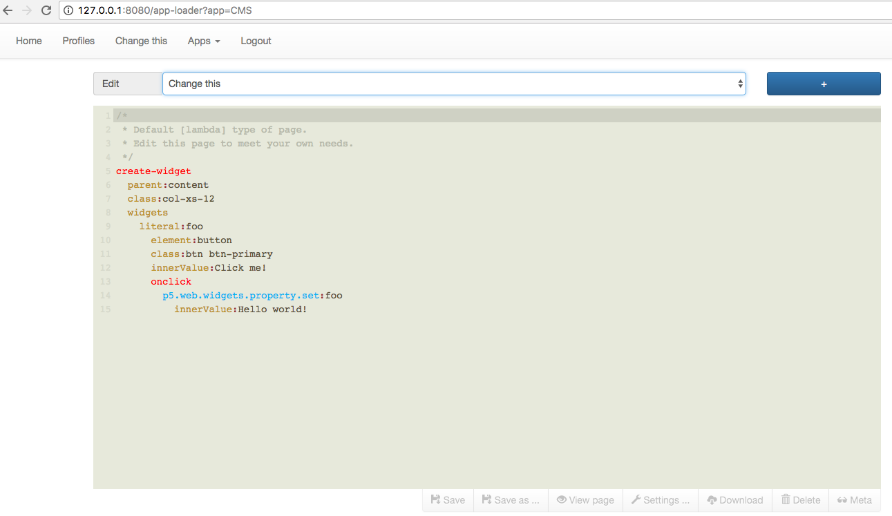

System42, an anti-CMS for Phosphorus Five
========

System42 is an example minimalistic "CMS" and use-case of [Phosphorus Five](https://github.com/polterguy/phosphorusfive).
It also includes several helper components. The purpose of System42, is to provide a starting point, 
and example/reference implementation when developing Phosphorus Five applications.

System42, is also a "host" for your web apps, by allowing you to install your apps.
To install an app into System42, is as simple as an x-copy operation, pasting your app 
into the "/system42/apps/" folder, with optionally one file called "launch.hl",
and another file called "startup.hl" - And your app should be ready for use.

The "startup.hl" file is evaluated when the server is started, and used for initializing
your app, by creating supporting Active Events, etc. The "launch.hl" file,
is expected to "launch" your app, whatever that means for your specific app.
If your app has a "startup.hl" file, you'd probably want to evaluate this file after the x-copy
operation.

The "components" folder works similarly, except it doesn't install an "app", but rather a "component", which
might be either a visual widget, or a supporting Active Event, or anything in between.

Below you can find the two most important folders in the system.

- [Components](components/) which are the components in System42, such as Ajax TreeViews, Modal Windows, etc
- [Apps](apps/) which are the preinstalled apps in System42, such as the "anti-CMS" and Hyperlambda Executor, etc

## Installation, getting started

Make sure you put the system42 folder inside of your _"/phosphorusfive/core/p5.webapp/"_ folder, and make sure
the System42 folder is called exactly _"system42"_. Remove any additional parts of its name, such as versioning number, etc.

Restart your web server process, and you should be up running.

During the first startup of System42, you will be required to supply a server salt, and a root password. The salt is just a bunch
of random characters used to salt your passwords, and seed the random number generator for cryptographic features. The root
password should be difficult to guess, especially in live environments, that are exposed onto the world wide web.

## Structure

The _"application-startup.hl"_ file is evaluated when your application pool starts. This file creates a 
couple of helper Active Events, for evaluating Hyperlambda files, and folders. In addition, it evaluates 
all files in the "/system42/startup/" folder.

When it is done with the above tasks, it will evaluate all "application specific" and "components specific"
startup files. These are files inside of any "/system42/apps/*/" and "/system42/components/*/" folders, 
who's names are "startup.hl".

This allows you to create startup Hyperlambda scripts, both on system level, and on application/component level, 
that needs some sort of startup/initialization scripts, to be evaluated during startup.

### The "apps" folder

This is the System42 version of your windows "C:/Program Files/" folder, and contains 
all apps in your System42 installation. See the documentation for the [apps](apps/)
folder for details about this folder.

### The "components" folder

This contains your components, which you can reuse in your apps. See the documentation for the [components](components/) 
folder for details about this folder.

### The "startup" folder

This folder contains files that are evaluated during application startup of your server, either because of your 
server rebooting, or because of the web-server process being restarted for some reasons. Normally you would want to either directly
or indirectly create your global Active Events here, which multiple apps somehow are dependent upon.

### Helper Active Events

Some of the more useful Active Events which you'll probably want to take advantage of in most of your applications, are listed below.

* [sys42.utilities.execute-lambda-file] - Executes one or more Hyperlambda files
* [sys42.utilities.execute-lambda-folder] - Executes all Hyperlambda files in a folder, recursively
* [sys42.utilities.get-widget] - Returns all lambda associated with a widget, including events (reverse engineers a widget)
* [sys42.utilities.empty-user-temp-folder] - Which empties a user's "temp" folder

System42 might also contain other supporting Active Events, depending upon which types of apps and/or components you have in your specific
installation. In addition, System42 contains a web based Hyperlambda editor, built on top of CodeMirror, an HTML editor,
built on top of CKEditor, and other things, that might help you out when creating your own apps. Including many helper widgets, such
as Ajax TreeViews, Ajax TabControls, Ajax DataGrids, and so on. System42, also by default, includes jQuery and Bootstrap for your
convenience.

System42 also contains a suite of Unit Tests, to test the integrity of Phosphorus Five. Which is highly extendible, such that you can 
create your own tests, and plug them into the existing suite.

