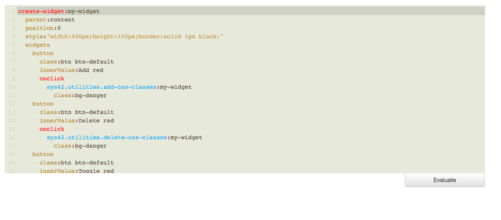

The Hyperlambda and p5.lambda Executor
========

The Executor allows you to evaluate Hyperlambda directly from within your browser. It consists of two
syntax highlighted Hyperlambda editors; One taking your "input Hyperlambda", and the other displaying its "output", after
having been evaluated. Below is a screenshot of it.



To try it out, start System42, and paste the following code into the input editor, and click the "Evaluate" button.

```
create-widget:foo
  element:h3
  parent:content
  class:col-xs-12
  innerValue:Click me!
  onclick
    set-widget-property:foo
      innerValue:Hello World!
```

To run the Executor, you need to be logged in as "root".


