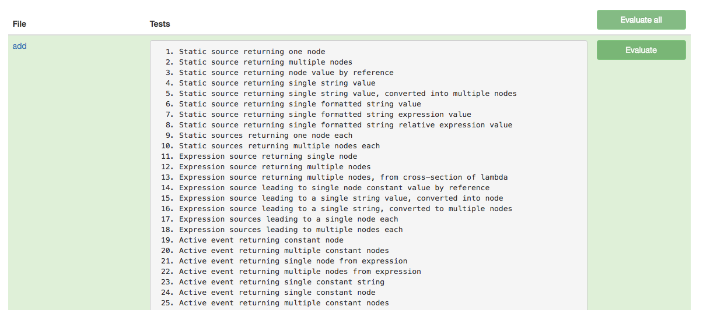

Unit tests for Phosphorus Five
========

This folder contains the unit tests for Phosphorus Five. You can easily extend them with your own tests, edit and modify them
from your browser, run them, and even create a "coverage report" of how many times each Active Event in your system is invoked
through your test suite.

To run the tests, you must be logged in as root. Below is a screenshot of the Unit tests in System42.

You can edit and view the code for each unit test files from within your browser. Which also makes it a nice way to start out
understanding specific keywords/Active Events in P5 and System42. The Unit test application, or framework, is easily extendible, allowing
for you to add up your own tests, as you develop your own keywords and/or Active Events.
